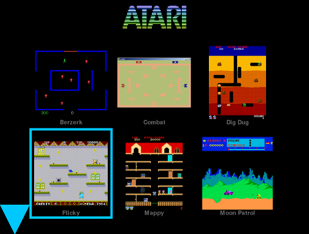

============================
RexMenu
============================

A simple image-tiling multipurpose program launcher, designed primarily as frontend for MAME but easily supporting other emulators.

Prerequisites
=============

* Python 2.7
* pygame
* python-evdev (optional, for screen blanking utility on Raspberry Pi)

In addition, RexMenu does not perform any discovery of ROMs or any scraping to
get metadata. Any images used have to be sourced outside this program.

Install
=======

Install with::

    pip install rexmenu

Usage
=====

The program may be started from the command line, or autostarted by some means
depending on your operating system. Either way, it is started simply by::

    python path/to/rexmenu.py

RexMenu needs a configuration file that lists all of the emulators and games.
An example file is in the source distribution as ``rexmenu.cfg.sample``. See
the Configuration section below for more details.

After starting the program, the display will change to a grid of thumbnail
images with one highlighted. If there are more games defined in the config file
than will fit on screen, up or down arrows will appear indicating that there
are more games in that direction. The joystick or arrow keys can be used to
move the highlight box to different games, and will scroll the list in the
direction of the arrow when you attempt to move the highlight box off the
screen in that direction. Pressing a predefined key will start that game.
Exiting from the game will return you to the RexMenu screen.

Raspberry Pi
============

RexMenu works well on the Raspberry Pi because pygame works on the console
graphics. You do not need to have X running.

RetroPie
--------

The `RetroPie <https://retropie.org.uk/>`_ distribution on `Raspberry Pi 3
<https://raspberrypi.org>`_ is a Raspbian- based linux distribution that
provides many emulators. Its default front was too complicated for my small
kids to use, so I designed this based on some code from a listener, Rex (hence
the name), to my `Player/Missile Podcast <https://playermissile.com>`_.

In RetroPie, you can autostart RexMenu by editing the file::

    /opt/retropie/configs/all/autostart.sh

Extras
------

For the RaspberryPi, I have included some extras. The program ``rpi-screen-
blank.py`` will turn off the monitor after a set amount of time (default of 10
minutes) where it doesn't detect any keyboard or mouse input. It works by using
the Python evdev module to monitor keyboard events and uses some RaspberryPi-
specific commands to blank the console screen, which enables the DPMS of the
monitor, putting it into low power standby mode.

Configuration
=============

The RexMenu configuration file tis in INI-style format, with one required
section that sets some application options, and any number of other sections
describing the available programs to launch.

The configuration file can be stored as ``.rexmenu`` in your home directory, or
as ``rexmenu.cfg`` in the same directory as the ``rexmenu.py`` program.

rexmenu Section
---------------

The ``rexmenu`` section defines the appearance and control of the launcher.

Keystroke Options
~~~~~~~~~~~~~~~~~

The configuration options for keystrokes are::

    run
    quit
    up
    down
    left
    right
    konami_a
    konami_b

where each of those takes a text list of `pygame keyboard identifiers
<https://www.pygame.org/docs/ref/key.html>`_ without the leading ``K_``. For
example, the default set of controls for ``run`` is::

    [rexmenu]
    run = Z X LSHIFT LCTRL SPACE RETURN 1 2 3 4

The Konami code is available (up up down down left right left right B A) for a
function, currently to exit the emulator, but in the future will be user-
defined.  The ``konami_a`` and ``konami_b`` config items are available to set
what the program will use for the B and A keys, defaulting to ``2`` and ``1``
respectively.

Image Options
~~~~~~~~~~~~~

* ``image path`` *(space separated list)* list of paths to search for images if
  the image isn't found in emulator-specific image paths. If a path has spaces
  within it, enclose the path in single or double quotes.
* ``thumbnail size`` *(int)* images will be resized to fit within the square with each side being this size in pixels

Other Options
~~~~~~~~~~~~~

* ``title`` *(string)* path to an optional title graphic displayed at the top of the screen
* ``windowed`` *(boolean)* if True, use window instead of full screen
* ``window width`` *(int)* height of window in pixels if in windowed mode
* ``window height`` *(int)* width of window in pixels if in windowed mode
* ``highlight size`` *(int)* width in pixels of the line used to draw the highlight box
* ``grid spacing`` *(int)* number of pixels padding between grid entries
* ``name spacing`` *(int)* number of pixels padding between grid image and text showing the name of the game
* ``clear screen`` *(boolean)* whether or not to clear the console screen before displaying the menu

Other Sections
--------------

The remaining sections of the config file describe a command line used to
launch the emulator, and the list of filenames of games that use that emulator.
Any number of entries may be included in the config file, and the program will
display all games in alphabetical order regardless of which section of the
config file they appear.

Entries for the same emulator but using different command line options are
possible.  For instance, to use the `atari800
<http://atari800.sourceforge.net/>`_ emulator in NTSC (60 Hz display) for some
games and PAL (50 Hz display) for others, two sections could be added::

    [atari800]
    /opt/games/atari8bit/Jumpman.atr = Jumpman

    [atari800 -pal]
    /opt/games/atari8bit/Jumpman.atr = Jumpman (PAL)

This is the format of entries: the key which is the path to the ROM file, and
the value which is the name of the game to display in the grid.

If the title is the same name as the filename, you can use the entry "title from name" and just list the paths to the games separated by whitespace::

    [atari800]
    title from name = /opt/games/atari8bit/Jumpman.atr /opt/games/atari8bit/Livewire.xex

If the emulator program is not in the search path, you can use the full path to
the emulator as the section title::

    [/opt/games/bin/atari800 -xl]
    /opt/games/atari8bit/yoomp.atr = Yoomp!

Images
------

Images for the grid are loaded based on the filename of the game, not the text
title. PNG and JPEG files are supported. The path is stripped off of the game
and the extension ".png" or ".jpg" is added to both the whole filename and the
filename stripped of its extension. The first one found is used. So for
``/opt/games/atari8bit/Jumpman.atr``, the names::

    Jumpman.atr.png
    Jumpman.atr.jpg
    Jumpman.png
    Jumpman.jpg

are searched for in that order.

They are searched for in the same directory as the game, or in one of the paths
specified by the ``image path`` item in either in the individual emulator
section, or the ``rexmenu`` section. The path specified in the emulator
sections will be searched before the paths in the ``rexmenu`` section.

Note again that RexMenu has no metadata scraping, so you'll have to download or
create the images yourself. For MAME, a relatively complete set of screenshot images can be found at::

    http://www.progettosnaps.net/snapshots/
